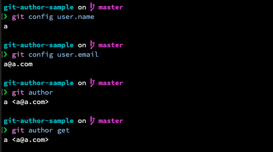
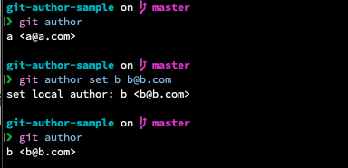
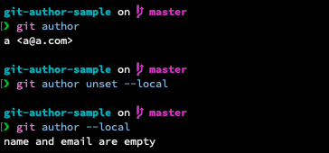
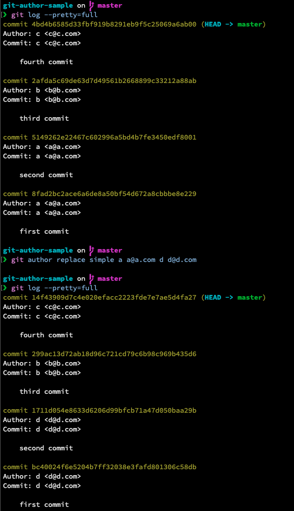
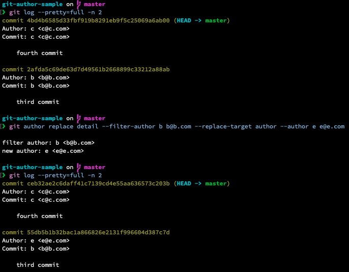

# git-author

[日本語ドキュメント](https://block-cube-lib.github.io/documentation/git-author/)

## Overview
- You can get or set user.name and user.email at oece.
- You can unset user.name and user.email at once.
- You can replace the author or committer of past commits.

## Installatoin
```sh
$ cargo install git-author
```

## Usage
```sh
# get
$ git author [config file location]
$ git author get [config file location]
# set
$ git author set [config file location] <name> <email>
# unset
$ git author unset [config file location]
# replace-simple
$ git author replace simple <old-name> <old-email> [new-name] [new-email]
# replace-detail
$ git author replace detail --filter-author <name> <email> --filter-committer <name> <email> --replace-target <replace-target>
```

## Description
### get
```sh
$ git author [config file location]
$ git author get [config file location]
```

You can get user.name and user.email.  


### set
```sh
$ git author set [config file location] <name> <email>
```

You can set user.name and user.eamil with `git author set foo foo@abc.com`.  


### unset
```sh
$ git author unset [config file location]
```

You can unset user.name and user.email.  


### replace
#### simple
```sh
$ git author replace simple <old-name> <old-email> [new-name] [new-email]
```

Replace the Author or Committer's `old-name` with `old-email` and `new-name` with `new-email` in the past commit.  
If new-name and new-email are omitted, use the name and email that can be obtained with `git author`.  


#### detail
```sh
$ git author replace detail --filter-author <name> <email> --filter-committer <name> <email> --replace-target <replace-target>
```

##### options
```sh
--filter-author <name> <email>       filter with author. Required when `filter-committer` is not specified.
--filter-committer <name> <email>    filter with committer. Required when `filter-author` is not specified.
--filter-type <filter-type>          You can specify `and` or `or`. Valid only both `filter-author` and `filter-
                                     committer` are specified. It is ignored at other times.
                                     The defalut is `and`.
                                     If `and` is specified, commits that match `author` and `committer` are
                                     specified, and if `or` is specified, commits that match either `author` or
                                     `committer` are included. [default: and]
--author <name> <email>              author after replacement. If not specified, use author which can be
                                     obrtained by `git author get`
--committer <name> <email>           committer after replacement. If not specified, use author which can be
                                     obrtained by `git author get`
--replace-target <replace-target>    Replacement target. You can specify `author` or`committer` or `author-and-
                                     committer`.
```



## License
MIT
